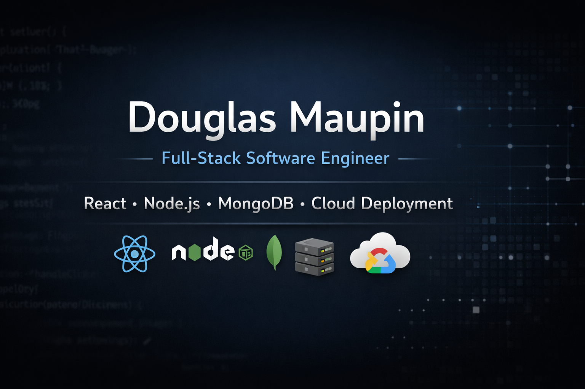

# 👋 Hi, I'm Douglas Maupin
🌐 Portfolio: https://maupin76.github.io  
📰 News Explorer: https://news.douglasmaupin.com  
👕 WTWR: https://wtwr.douglasmaupin.com

### Full-Stack Software Engineer  
📍 Meridian, Idaho

I build modern full-stack web applications using **JavaScript, React, Node.js, Express, and MongoDB** and deploy them to **Google Cloud Linux servers using PM2 and Cloudflare**.

My focus is on writing clean, maintainable code, building scalable APIs, and creating intuitive user experiences.

---

# 🚀 Live Applications

### 📰 News Explorer
Full-stack news search platform allowing users to search and save articles.

🌐 https://news.douglasmaupin.com

Features

• React frontend  
• Node.js + Express backend  
• MongoDB database  
• JWT authentication  
• External news API integration  
• Deployed on Google Cloud VM  
• Secured with Cloudflare  

---

### 👕 WTWR (What To Wear)

Weather-based clothing recommendation application.

🌐 https://wtwr.douglasmaupin.com

Features

• Weather API integration  
• Clothing management system  
• User authentication  
• React frontend  
• Node.js / Express backend  
• MongoDB database  
• Google Cloud deployment  
• Cloudflare security  

---

# 🛠 Tech Stack

### Frontend

### Backend

### Databases

### Cloud / DevOps

### Tools

---

# ☁️ Application Architecture

Typical architecture used in my deployed applications
React Frontend
↓
Cloudflare (DNS + SSL + Security)
↓
Google Cloud VM (Ubuntu Linux Server)
↓
Node.js + Express API
↓
MongoDB Database

---

# 🚀 Deployment Workflow
Local Development
↓
GitHub Repository
↓
Google Cloud Virtual Machine
↓
PM2 Process Manager
↓
Cloudflare DNS + SSL
↓
Live Production Website

---

# 📊 GitHub Stats

---

# 🌐 Professional Websites

Developed and maintain live websites for local businesses

• Thai Royal Therapeutic  
• Siam Thai Body Works  

---

# 📫 Connect With Me

LinkedIn  
https://www.linkedin.com/in/douglas-maupin/

GitHub  
https://github.com/Maupin76

---

# 🔭 Currently Working On

• Improving News Explorer production deployment
• Finalizing WTWR Responsiveness Front Desktop to Mobile
• Expanding cloud infrastructure knowledge  
• Building additional full-stack portfolio projects  
• Continuing software engineering training
